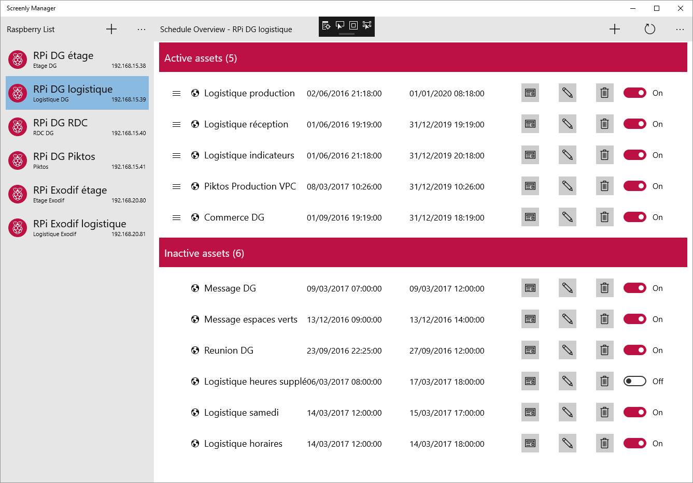

# Screenly Manager
UWP app that help you to manage Raspberry Pi with [Screenly OSE](https://www.screenly.io/ose/) app

Screenly provides web interface that can easily manage current device. If you have many Raspberry's, you have to switch between each device.

This app allows you to groups all your devices in unique interface to manage them more easily.

